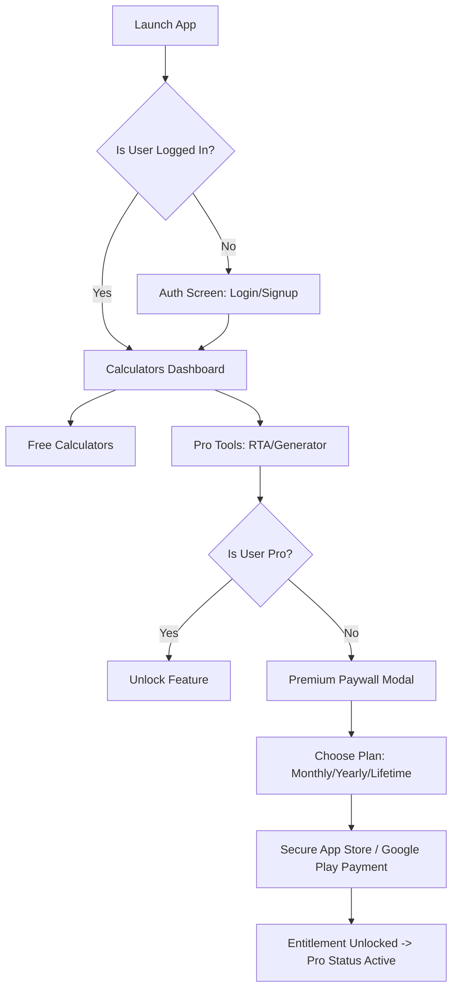

# Product Requirements Document (PRD) - SoundEngg

## 1. Problem Statement
Professional sound engineers, FOH (Front of House) mixers, system technicians, and RF coordinators work in high-pressure, fast-paced live events. They need to perform precise calculations (delay times, SPL drop, line array spacing, frequency-to-note matching) and diagnostic tasks (RTA spectrum analysis, signal generation) on the fly. 

**The core issues they face are:**
*   **Lack of internet access:** Event venues, concert halls, and festival grounds often have poor or zero cellular connection. Existing web-based calculators fail on-site.
*   **Clunky & slow interfaces:** Most audio tools are either overly complex desktop software or outdated mobile apps that take too long to open and configure during a live sound check.
*   **Expensive licensing:** Professional measurement software costs hundreds of dollars, making it inaccessible for independent freelancers or gig workers starting out.

SoundEngg solves these problems by providing an **offline-first, blazing-fast, premium utility suite** that runs natively on mobile devices.

---

## 2. Target Users
*   **The Live Gig Technician:** Ages 20–45. Comfort with technology is moderate to high. Their goal is to quickly tune PA systems, calculate delay speaker times, and measure feedback frequencies on the fly during soundchecks. They value offline reliability and speed.
*   **The System Engineer / Designer:** Ages 25–60. Highly tech-savvy. They design complex sound system alignments (subwoofer arrays, line arrays) and need precise formulas to coordinate audio phase relationships.
*   **The RF & Wireless Coordinator:** Techs managing micro-frequency spectrums and needing rapid access to pinouts and connector references under stage pressures.

---

## 3. Product Vision
SoundEngg is the **ultimate, offline-first mobile toolkit for professional audio technicians**, providing precision-verified calculators and real-time analyzers directly in the pocket of every stage hand and system engineer worldwide.

---

## 4. Core Features

### Must-Have (MVP)
*   **Offline Operation (PWA/Capacitor):** App must load and function 100% offline using service worker caching.
*   **Precision Calculators:**
    *   *Delay Calculator:* Temperature-adjusted millisecond-to-distance timing.
    *   *Subwoofer Array Calculator:* End-fire and gradient spacing alignment formulas.
    *   *Impedance & Power Calculator:* Multi-speaker wiring load calculators.
*   **Real-Time Audio Analyzer (RTA):** Low-latency FFT microphone input for spectrum monitoring.
*   **Signal Generator:** Sine, white noise, and pink noise generators for testing system responses.
*   **Local & Cloud Authentication:** Supabase Auth for registration/login.
*   **Entitlement Gateways (Premium Modals):** Ad-blockers, premium feature locks, and subscription gates.
*   **Native App Store Billing:** Integrated RevenueCat iOS and Android SDK wrapper.

### Nice-to-Have (V2)
*   **Custom Micro-Calibration Profiles:** Importing custom `.cal` files to calibrate the smartphone's built-in microphone response.
*   **RF Spectrum Coordinator:** Frequency coordination mapping tool for wireless mics.
*   **Shared Project Saved Presets:** Allowing sound techs to save their gig measurements to their profile and sync to the cloud when online.

---

## 5. App Flow

### User Journey Steps:
1.  **Launch:** Tech opens the app during a soundcheck (even with airplane mode active).
2.  **Home Page:** Direct access to core utility calculators.
3.  **Authentication:** Users can sign up for a free account to back up settings or sync subscription access.
4.  **Feature Gate:** Trying to run the RTA Spectrogram or the Signal Generator checks for `window.isUserPro`. 
5.  **Paywall:** If not a Pro user, the modal displays localized pricing options (e.g., $1.99 monthly / $19.99 yearly / $34.99 lifetime).
6.  **Checkout:** Proceeding to payment triggers the native App Store sheet via RevenueCat, immediately updating the UI state on success.

---

## 6. Success Metrics
*   **Offline Engagement:** % of app sessions launched in offline states.
*   **Adoption Rate:** Free-to-Premium Conversion Rate (Target: 3% of active installations).
*   **User Retention:** Weekly active users during concert/touring seasons (April–September).
*   **App Stability:** Crash-free sessions > 99.9% on native mobile boundary.

---

## 7. Deliberately NOT Building (Version One)
*   **Multitrack Audio Player:** No audio playback tracks or virtual mixing consoles.
*   **3D Acoustic Room Modeler:** No graphical room modeling (this requires high CPU desktops).
*   **Hardware Interface USB Drivers:** No custom ASIO/CoreAudio hardware syncing (built-in microphone/audio output is the focus).
