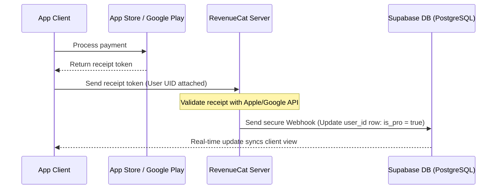

# Security & Access Document (SAD) - SoundEngg

## 1. Authentication Standards
SoundEngg uses Supabase GoTrue Auth for secure identity management.

*   **Credentials:** Users authenticate using email and password.
*   **Token Handling:** Upon login, Supabase returns a JSON Web Token (JWT) containing the user’s UID and session parameters. The token is stored locally in client memory or `localStorage` via our secure wrapper `safeStorage` to ensure sessions persist across app launches.
*   **Auto-Refresh:** The client-side Supabase SDK is configured with `autoRefreshToken: true` to automatically query new credentials from the auth API before the current JWT expires (every 3600 seconds).

---

## 2. Database Schema & Access Control

### PostgreSQL Database Schema
Subscriptions and pro states are tracked in two core tables under the public schema in PostgreSQL:

#### `profiles` Table
Stores user profile information.
*   `id`: `uuid` (Primary key, referencing `auth.users.id`)
*   `full_name`: `text`
*   `created_at`: `timestamp with time zone`

#### `subscriptions` Table
Tracks user subscription history and entitlements.
*   `id`: `uuid` (Primary key)
*   `user_id`: `uuid` (Foreign key, referencing `auth.users.id`)
*   `is_pro`: `boolean` (Default: `false`)
*   `subscription_tier`: `text` (e.g. `'monthly'`, `'yearly'`, `'lifetime'`)
*   `expires_at`: `timestamp with time zone` (Expiration date of current subscription tier)
*   `updated_at`: `timestamp with time zone`

---

## 3. Row Level Security (RLS) Policies
To prevent database tampering, all tables have Row Level Security enabled. Clients cannot read or write data belonging to other users.

### RLS Rules:
```sql
-- Enable Row Level Security
ALTER TABLE public.profiles ENABLE ROW LEVEL SECURITY;
ALTER TABLE public.subscriptions ENABLE ROW LEVEL SECURITY;

-- Profiles: Anyone can read profiles (needed for sharing, etc.), but users can only update their own profile
CREATE POLICY "Users can view all profiles" ON public.profiles FOR SELECT USING (true);
CREATE POLICY "Users can update their own profile" ON public.profiles FOR UPDATE USING (auth.uid() = id);

-- Subscriptions: Users can only read their own subscription state. No client is allowed to insert or update subscriptions directly.
CREATE POLICY "Users can view their own subscription" ON public.subscriptions FOR SELECT USING (auth.uid() = user_id);
```

---

## 4. Secure Payment Validation Flow
To prevent payment fraud, the client is never trusted to write directly to the database. All transaction validations are handled server-side.



### Webhook Security parameters:
*   RevenueCat calls your Supabase API Webhook URL.
*   **Verification Header:** The webhook checks for a secure `Authorization` bearer token or API token in the request header. If the token matches the secret generated on the server, the database updates the subscription row.
*   This prevents users from tampering with local app bundles or intercepting HTTP requests to manually set `isUserPro = true`.

---

## 5. Client Content-Gate Mechanics
If a user is not Pro, access is restricted as follows:

*   **RTA spectrogram & Signal Generator:** Blocked by UI overlays. The functions `window.isPremiumActive('spectrogram')` and `window.isPremiumActive('generator')` return `false`, blocking DOM updates.
*   **Ad-Gate Bypass:** If `window.isUserPro` is `false`, `adManager.js` initializes Google AdSense scripts or native mobile banner ads. If `true`, all ad containers are set to `display: none` and all banner triggers are disabled.

---

## 6. User Roles & Permissions

SoundEngg implements four discrete roles that define what features are accessible:

*   **Role 1: Anonymous / Guest**
    *   *Permissions:* Can view marketing pages, help files, and basic calculators (Delay, Voltage).
    *   *Restrictions:* Blocked from saving custom mic calibration profiles, syncing configurations, accessing advanced tools (RTA, Ear Training), and offline persistent backups.
*   **Role 2: Free Authenticated User**
    *   *Permissions:* All Guest features + access to user profile customization, saving calculation histories locally, and syncing user configurations to the Supabase database.
    *   *Restrictions:* Blocked from advanced premium tools (RTA Spectrogram, Signal Generator, Ear Training) unless a temporary promotional pass is unlocked via ad gates. Standard banner and interstitial ads are visible.
*   **Role 3: Pro User (Monthly/Yearly Subscription)**
    *   *Permissions:* Full, unrestricted access to all calculators, RTA, Signal Generator, custom mic calibration profiles, priority email support, and 100% ad-free experience.
    *   *Restrictions:* Blocked from admin controls. Entitlement ceases if the subscription expires or fails to renew.
*   **Role 4: Lifetime Pro User (One-time Purchase)**
    *   *Permissions:* Identical to Pro User, but access is permanent and never expires.
*   **Role 5: Administrator**
    *   *Permissions:* Full database writes, moderation of premium blog posts, access to the Supabase and RevenueCat administration consoles.

---

## 7. Error Handling Guide

When components or connections fail, SoundEngg handles failures gracefully to prevent app crashes:

*   **Failure 1: Supabase API Offline / Network Interrupted**
    *   *Response:* The authentication modules fail silently or show a toast alert: `"Offline Mode Active: Syncing disabled"`. The app switches to offline cache mode via `SafeStorage` and the user maintains full access to cached calculators.
*   **Failure 2: Invalid User Credentials on Login**
    *   *Response:* The auth module intercepts the validation error and triggers an animated error box: `"Incorrect email or password. Please try again."` rather than crashing the interface.
*   **Failure 3: RevenueCat Key Validation / Store Connection Failure**
    *   *Response:* The billing helper catches the exception and falls back to the locally cached subscription status `soundengg_cached_is_pro` so that verified Pro users do not lose access when offline.
*   **Failure 4: Microphone Permission Denied**
    *   *Response:* If the user blocks microphone access, the RTA component catches the browser error and replaces the analyzer canvas with an informative overlay: `"Microphone access is required to run the RTA. Please enable permissions in your device settings."`

---

## 8. Edge Cases Handling

*   **Edge Case 1: Empty Form Submissions**
    *   *Handling:* All calculator inputs have HTML validation parameters (`required`, `min`, `max`) and JavaScript sanitation filters. Submitting empty values returns a default baseline value (e.g. `0` or default room temperature) instead of returning `NaN` or freezing the calculations.
*   **Edge Case 2: Session Expiration During Active Use**
    *   *Handling:* If a JWT session expires while the app is open, the Supabase client-side listener triggers an automatic refresh token query in the background. If the refresh fails (user password changed elsewhere), the app logs out gracefully, updates cached local permissions to `free`, and informs the user.
*   **Edge Case 3: App Initial Launch with No Network Connection**
    *   *Handling:* The service worker immediately serves the static PWA shell. Supabase auth initialization catches the net error and skips cloud sync, logging the user in under the cached local profile.

---

## 🤖 Prompt to Generate This Document
```text
"Act as a senior security engineer who specializes in early-stage product security. Create a Security and Access Document for my app. It should cover the authentication method that best fits my use case, all user roles and exactly what each role can and cannot do, row-level security rules for the database, a complete error handling guide for all major failure points, and a list of edge cases I need to handle before launch. Write everything in plain English so a non-technical founder can understand it. My app idea is: SoundEngg, a fast, offline-first mobile toolkit for professional audio technicians."
```

