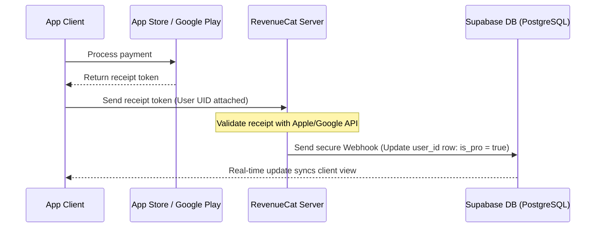

# Security & Access Document (SAD) - SoundEngg

## 1. Authentication Standards
SoundEngg uses Supabase GoTrue Auth for secure identity management.

*   **Credentials:** Users authenticate using email and password.
*   **Token Handling:** Upon login, Supabase returns a JSON Web Token (JWT) containing the user’s UID and session parameters. The token is stored locally in client memory or `localStorage` via our secure wrapper `safeStorage` to ensure sessions persist across app launches.
*   **Auto-Refresh:** The client-side Supabase SDK is configured with `autoRefreshToken: true` to automatically query new credentials from the auth API before the current JWT expires (every 3600 seconds).

---

## 2. Database Schema & Access Control

### PostgreSQL Database Schema
Subscriptions and pro states are tracked in two core tables under the public schema in PostgreSQL:

#### `profiles` Table
Stores user profile information.
*   `id`: `uuid` (Primary key, referencing `auth.users.id`)
*   `full_name`: `text`
*   `created_at`: `timestamp with time zone`

#### `subscriptions` Table
Tracks user subscription history and entitlements.
*   `id`: `uuid` (Primary key)
*   `user_id`: `uuid` (Foreign key, referencing `auth.users.id`)
*   `is_pro`: `boolean` (Default: `false`)
*   `subscription_tier`: `text` (e.g. `'monthly'`, `'yearly'`, `'lifetime'`)
*   `expires_at`: `timestamp with time zone` (Expiration date of current subscription tier)
*   `updated_at`: `timestamp with time zone`

---

## 3. Row Level Security (RLS) Policies
To prevent database tampering, all tables have Row Level Security enabled. Clients cannot read or write data belonging to other users.

### RLS Rules:
```sql
-- Enable Row Level Security
ALTER TABLE public.profiles ENABLE ROW LEVEL SECURITY;
ALTER TABLE public.subscriptions ENABLE ROW LEVEL SECURITY;

-- Profiles: Anyone can read profiles (needed for sharing, etc.), but users can only update their own profile
CREATE POLICY "Users can view all profiles" ON public.profiles FOR SELECT USING (true);
CREATE POLICY "Users can update their own profile" ON public.profiles FOR UPDATE USING (auth.uid() = id);

-- Subscriptions: Users can only read their own subscription state. No client is allowed to insert or update subscriptions directly.
CREATE POLICY "Users can view their own subscription" ON public.subscriptions FOR SELECT USING (auth.uid() = user_id);
```

---

## 4. Secure Payment Validation Flow
To prevent payment fraud, the client is never trusted to write directly to the database. All transaction validations are handled server-side.



### Webhook Security parameters:
*   RevenueCat calls your Supabase API Webhook URL.
*   **Verification Header:** The webhook checks for a secure `Authorization` bearer token or API token in the request header. If the token matches the secret generated on the server, the database updates the subscription row.
*   This prevents users from tampering with local app bundles or intercepting HTTP requests to manually set `isUserPro = true`.

---

## 5. Client Content-Gate Mechanics
If a user is not Pro, access is restricted as follows:

*   **RTA spectrogram & Signal Generator:** Blocked by UI overlays. The functions `window.isPremiumActive('spectrogram')` and `window.isPremiumActive('generator')` return `false`, blocking DOM updates.
*   **Ad-Gate Bypass:** If `window.isUserPro` is `false`, `adManager.js` initializes Google AdSense scripts or native mobile banner ads. If `true`, all ad containers are set to `display: none` and all banner triggers are disabled.
