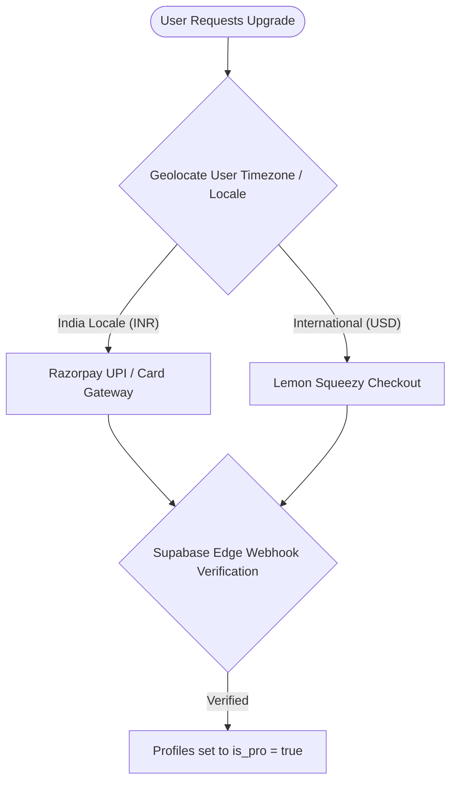

# SoundEngg Project Context & Technical Architecture Manual

This document serves as the comprehensive technical manual, codebase directory, and architecture specification for the **SoundEngg Console** project. It details the project logic, file structures, functional connections, historical milestones, payment gateways, and future development plans.

---

## 1. Project Overview & Target Audience

* **What it is:** **SoundEngg** (with its premium tier **SoundEngg Pro**) is a professional, high-precision utility toolkit and dashboard for audio engineers, live sound system technicians, RF coordinators, and acoustical consultants. It runs as an offline-first Single Page Application (SPA) on browsers and as a native mobile app (iOS & Android) via **Ionic Capacitor**.
* **Target User:** Front of House (FOH) mixers, monitor engineers, PA system technicians, stage RF managers, and studio technicians working under time-critical, high-stress live event environments (concerts, festivals, broadcast).
* **Core Value Proposition:** Fast, phase-accurate, offline-first access to essential acoustic calculations, real-time spectrum analysis (RTA), pitch tuning, ear training, and pinout diagrams. The UI features a high-contrast, low-light optimized **VFD (Vacuum Fluorescent Display)** industrial design suited for outdoor shows and dark concert halls.

---

## 2. Historical Timeline & Milestones

The development of SoundEngg is segmented into distinct operational phases:

### Phase 1: Core Foundation & Visual Design (Late 2025 - Early 2026)
* **Monolithic Structure:** Created the core HTML layouts and established the retro-futuristic VFD neon styling (amber, cyan, pitch-black backdrops, and glassmorphic panels).
* **Audio Computations:** Programmed phase-accurate delay compensation, inverse-square law equations, and broadside/cardioid array delay spacing.

### Phase 2: SEO, AdSense, & PWA offline-first (Spring 2026)
* **SEO Optimization:** Added trust Pages (`/about.html`, `/contact.html`), meta descriptions, dynamic sitemaps, and clean URLs via Vercel configurations.
* **Static Blog Engine:** Developed `/generate-static-blog.js` to compile markdown blog posts into static HTML files for crawlability, earning AdSense compliance.
* **Offline-First Capability:** Wired a custom `service-worker.js` caching system to guarantee full utility operation in remote, network-dead festival fields.

### Phase 3: Hybrid Billing Gateway & Capacitor Wrappers (May 2026)
* **Dynamic Pricing Geolocation:** Programmed timezone offsets and Geo-IP database hooks to automatically swap Razorpay checkouts (domestic Indian Rupees INR) and Lemon Squeezy checkouts (international US Dollars USD).
* **WebView CSP Fixes:** Integrated the Capacitor In-App Browser plugin (`@capacitor/browser`) to display payment flows in native secure sheets, bypassing WebView sandboxing blockages.
* **Bypass Ad Lockups:** Integrated mobile AdMob banners and rewarded ads while implementing a bypass fail-safe (unlocking screens if Google AdSense or AdMob scripts fail to initialize).

### Phase 4: Brevo Integration & Authentication Refinement (June 2026)
* **API Key SMTP Migration:** Migrated Supabase transactional email configurations from SMTP keys (`xsmtpsib-...`) to full transactional API credentials (`xkeysib-...`) using Deno Edge Functions.
* **Beta Account Automation:** Deployed the `claim-beta` Deno Edge Function. It registers leads, auto-assigns 30-day Pro status, generates a unique 8-character password, and emails credentials automatically via Brevo.
* **Password Recovery Workflow:** Integrated in-app password reset flows. Triggering the `PASSWORD_RECOVERY` event on login redirects users into their active profile modal to safely update credentials.

### Phase 5: Codebase Decluttering & CSS Partitioning (Current)
* **Root Cleanup:** Moved 12 diagnostic scripts and scratch python generators to the [dev-tools/](file:///Users/sujansubedi/Documents/GitHub/soundengg-website/dev-tools/) folder.
* **CSS Split:** Partitioned the massive 5,726-line `styles.css` file into 7 modular sheets, keeping `styles.css` strictly as a bootsheet for imports.

---

## 3. Directory Structure & File Index

The repository is organized as follows:

```
soundengg-website/
├── about.html                  # About Page (SEO/AdSense compliance)
├── app.html                    # Main Single Page Application Console
├── index.html                  # Public Marketing & Landing page
├── pro.html                    # Premium benefits landing page
├── blog.html                   # Blog archive page
├── contact.html                # Contact Page (Ajax submission)
├── beta.html                   # Closed Beta sign up portal
├── app-version.json            # Version config for update checks
├── package.json                # Project dependencies
├── vercel.json                 # Vercel routing, redirects, headers
├── service-worker.js           # PWA offline cache definitions
├── build-app.js                # Production asset minification & bundle script
├── generate-static-blog.js     # Parses blog markdown into static HTML files
├── assets/                     # Application resource tree
│   ├── css/                    # Stylesheet architecture
│   │   ├── styles.css          # Master Bootsheet (Imports sub-files)
│   │   ├── variables.css       # Variables, colors, resets, animations
│   │   ├── layout.css          # Top bar, grids, widget wrappers
│   │   ├── components.css      # Numeric inputs, search, buttons, sliders
│   │   ├── modals.css          # Dialogue popups, slideout system panels
│   │   ├── tools.css           # Instrument interfaces, RTA, Tuner, array charts
│   │   ├── pages.css           # Blog reader, author page, contact forms
│   │   └── responsive.css      # Responsive media queries, mobile layouts
│   ├── js/                     # JavaScript modules
│   │   ├── main.js             # SPA Router, payment routers, update handlers
│   │   ├── components/         # Sub-module UI engine bindings
│   │   ├── modules/            # Auth and Premium controllers
│   │   └── utils/              # Calculation utilities & ad managers
└── dev-tools/                  # Developer utilities & diagnostics
```

---

## 4. Detailed Component & Code Logic

### 4.1. Core Calculation Utility
* **File:** [audioCalcs.js](file:///Users/sujansubedi/Documents/GitHub/soundengg-website/assets/js/utils/audioCalcs.js)
* **Key Functions:**
  * `calcSpeedOfSound(tempC)`: Returns speed of sound in m/s: $c = 331.3 + (0.606 \times tempC)$.
  * `calcSpeedOfSoundF(tempF)`: Returns speed of sound in ft/s: $c_f = 1052.3 + (1.106 \times tempF)$.
  * `calcDelayMs(distance, speed)`: Computes time delay: $t = \frac{distance}{speed} \times 1000$.
  * `calcCardioidGradient(speed, freq)`: Calculates optimal physical spacing ($d = \frac{\lambda}{4}$) and phase delay ($t_{ms} = \frac{d}{speed} \times 1000$) for cardioid gradient arrays.
  * `calcBroadside(speed, freq)`: Returns broadside subwoofer limits. Spacing limit to prevent power alley beaming is $d_{limit} = \frac{2}{3} \lambda$.
  * `calcInverseSquareLaw(d1, d2)`: Computes attenuation over distance: $\Delta dB = 20 \log_{10}(\frac{d_1}{d_2})$.

### 4.2. SPA Router & App Flow
* **File:** [main.js](file:///Users/sujansubedi/Documents/GitHub/soundengg-website/assets/js/main.js)
* **Key Functions:**
  * `showView(targetView, navButton, skipHistory, isBackAction)`: 
    * Hides all active viewports and displays the target view layout.
    * Stops audio oscillators, spectrum analyser loops, chromatic tuner inputs, and ear training game engines for inactive views to save hardware power.
    * Manages internal view stacks (`window.appNavigationHistory`) to allow Capacitor or hardware back actions.
  * `initAppVersionCheck()`: Fetches `/app-version.json` remotely, compares local native build numbers (`appBuild` from `@capacitor/device`), and triggers a force update modal if outdated.

### 4.3. Authentication System
* **File:** [auth.js](file:///Users/sujansubedi/Documents/GitHub/soundengg-website/assets/js/modules/auth.js)
* **Key Functions:**
  * `initAuthSystem()`: Instantiates Supabase SDK Client (`window.supabaseClient`). Binds global events to sign-in, signup, logout, and password recovery forms.
  * `handleAuthStateChange(event, session)`: Fired asynchronously by GoTrue when session updates. Toggles UI states (changes auth buttons to user circles, triggers DB profile synchronizations).
  * `syncSubscriptionStatus(session)`: Validates user records from the Supabase public `profiles` table to update subscription tier state.

### 4.4. Pro Access & Payments
* **File:** [premium.js](file:///Users/sujansubedi/Documents/GitHub/soundengg-website/assets/js/modules/premium.js)
* **Key Functions:**
  * `updatePremiumUI(isPro)`: Toggles class `.is-pro` on `<body>`. Removes lock screens on advanced calculators, unlocks RTA high-resolution configurations, and adjusts pricing selector boxes.

### 4.5. Real-Time Spectrogram (RTA)
* **File:** [rtaEngine.js](file:///Users/sujansubedi/Documents/GitHub/soundengg-website/assets/js/components/rtaEngine.js)
* **Key Functions:**
  * Uses Web Audio API `AudioContext` and `AnalyserNode`.
  * Computes FFT (Fast Fourier Transform) arrays.
  * Renders a 60FPS canvas spectrogram waterfall and linear frequency bars.
  * Features A, C, and Z weighting filters, peak hold graphs, and peak frequency indicators.

### 4.6. Tuner fundamental tracking
* **File:** [tunerEngine.js](file:///Users/sujansubedi/Documents/GitHub/soundengg-website/assets/js/components/tunerEngine.js)
* **Key Functions:**
  * Employs time-domain autocorrelation algorithms to identify fundamental pitch.
  * Maps frequency to closest cents deviation on standard equal temperament scale ($A_4 = 440Hz$).

---

## 5. Billing Gateway Configurations

SoundEngg routes users dynamically to optimize transaction success and fees:



### 5.1. Indian Users (Razorpay)
* **Pricing:** ₹199 / month, ₹1,999 / year, ₹3,499 / lifetime.
* **Method:** Routed natively using the `capacitor-razorpay` integration for UPI and card options.

### 5.2. International Users (Lemon Squeezy)
* **Pricing:** $2.99 / month, $29.99 / year, $49.99 / lifetime.
* **Method:** Opened in native browser sheets (`@capacitor/browser`) to safely handle Apple Pay, Google Pay, card networks, and PayPal.

---

## 6. Verification & QA Standard

To guarantee clean production builds and prevent application regression, run the following steps:

1. **Local Build Compilation:**
   ```bash
   npm run build
   ```
2. **Capacitor Android/iOS Sync:**
   ```bash
   npx cap sync
   ```
3. **Local PWA Testing:**
   Open Chrome DevTools, toggle **Network: Offline**, and verify:
   * The Service Worker cache serves all calculator tools.
   * Modals slide, delay calculations process, and tuner pages render successfully.

---

## 7. Future Roadmap

### Phase 1: Mobile UI/UX Redesign (Next Action)
* Implement safe-area aware headers (`#mobile-safe-header`) and bottom glassmorphic tab bars (`#mobile-bottom-tabs`) to replace desktop header configurations on mobile viewports.
* Use CSS to transform standard desktop dialog modals into native-feeling slide-up bottom drawer sheets.
* Integrate `@capacitor/haptics` to trigger light vibration impulses on controls.
* Hook the View Transitions API inside `showView` for sliding navigation directions.

### Phase 2: App Store Submissions
* Build release Android App Bundle (`app-release.aab`) and iOS packages.
* Submit to Google Play Console and Apple App Store.

### Phase 3: Hardware Integrations
* Support loader functions for calibration data files (.cal) in the RTA Spectrum analyzer.
